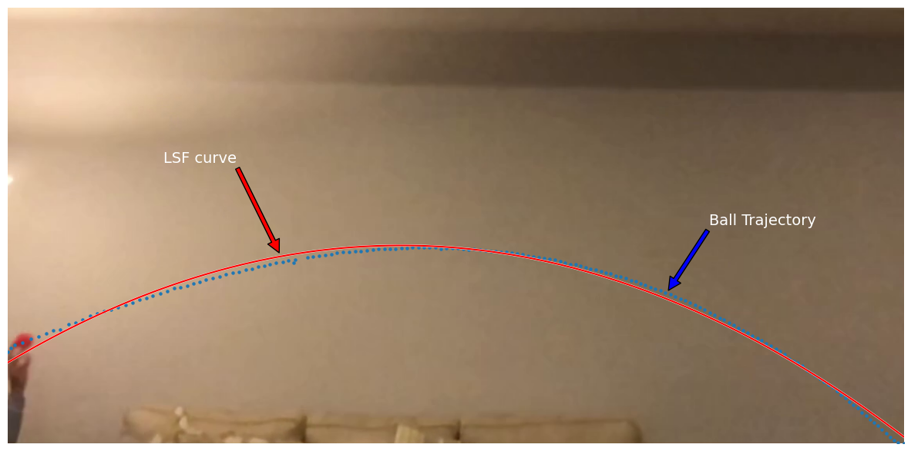

# Ball Trajectory Tracking with Parabolic Curve Fitting
This program uses computer vision techniques to track a moving ball and predict its trajectory. It takes a video file as input and returns a plot of the trajectory with a fitted parabolic curve.

## Prerequisites
- Python 3.7 or higher
- OpenCV
- NumPy
- Matplotlib

## Usage
1. Clone the repository
2. Install the required libraries: pip install opencv-python numpy matplotlib
3. Place the video file in the repository
4. Run the program: python3 ball_tracking.py

## Working
- The program reads the input video file and converts each frame into the HSV color space.
- A mask is applied to isolate the color of the ball. Here, the color of the ball is green.
- The pixels belonging to the ball are identified using the mask and the center of the ball is calculated.
- The center of the ball is plotted on each frame of the video.
- A parabolic curve is fit to the trajectory of the ball using the least squares method.
- The landing point of the ball is predicted using the equation of the fitted parabolic curve.
- A plot of the trajectory of the ball with the fitted parabolic curve is displayed.

## Example
Below is an example of the output generated by the program.

## License

[MIT](https://choosealicense.com/licenses/mit/)
