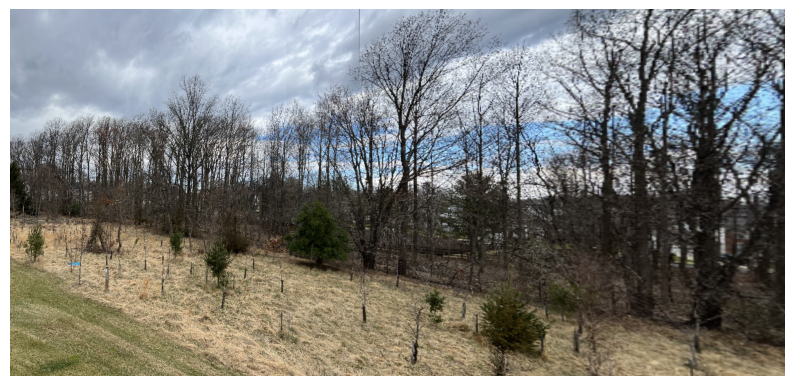

# Image stitching (Homography)
Image stitching using feature detection, matching, RANSAC algorithm and Homography to obtain the final panorama image.

## Prerequisites
- Python 3.7 or higher
- OpenCV
- NumPy
- Matplotlib

## Usage
1. Install the required libraries: pip install opencv-python numpy matplotlib
2. Run the program: python image_stitching.py

## Working
1. Run the "image_stitching.py" python file in any python environment to obtain the stitched images at all stages and final panorama image.

## Example
Below is an example of the output generated by the program.

## License

[MIT](https://choosealicense.com/licenses/mit/)